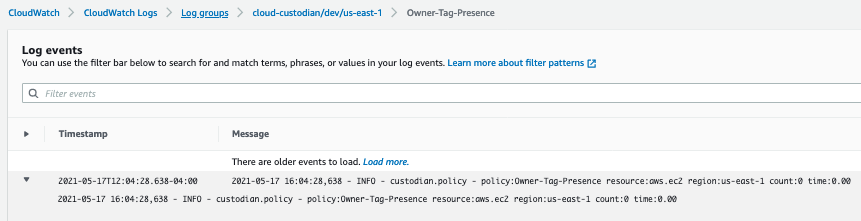

# Quickstart Pipeline for cloudcustodian/c7n

This repository contains the necessary code to build and deploy c7n as a containerized application into ECS.
Once deployed this allows users to define policies to enable a well managed cloud infrastructure that aligns with their security and cost needs and constantly enforce those policies.
## Prerequisites
- Github Repository with the contents of this repository 
- AWS Account and aws cli properly configured
- Github Token with the following credentials:


## Creating Pipeline
To create the pipeline run the following 
```aws cloudformation create-stack --stack-name c7n-pipeline --template-body file://pipeline/pipeline.yaml --capabilities CAPABILITY_NAMED_IAM --parameters ParameterKey=RepositoryName,ParameterValue=REPONAME ParameterKey=RepositoryOwner,ParameterValue=YOURUSER ParameterKey=GitHubToken,ParameterValue=YOURGITTOKEN```

This will create a cloudformation stack: c7n-pipeline which contains the necessary resources and permissions required for a CI/CD pipeline with a deployment target of ECS.


## Pipeline Stages
### Build Stage
- Install dependencies
- Lint all cloudformation templates in infrastructure folder using cfn_nag
- Lint all ruby code in repo using rubocop
- Build dockerfile
- test docker image
- tag docker image
- push docker image

### Deploy Stage
- Install dependencies
- Deploy ECS Cluster cloudformation stack
- Deploy ECS Service cloudformation stack
- Test Infrastructure

## Validating Deployment
To validate that c7n is running as expected we can view the logs in cloudwatch log groups as seen below:

